# React Quiz Application

This is a quiz application built with React for the frontend and Node.js with Express for the backend. It fetches quiz data from an external API and provides a user-friendly interface for taking the quiz.

## Features

-   Landing page with name input
-   Quiz questions displayed with multiple-choice options
-   Real-time feedback when selecting an answer
-   A timer for the quiz.
-   Question matrix showing progress
-   Displaying solution in summary of results.
-   Shows time spent on each question
-   Score calculation and display
-   Responsive design
-   Uses React Router for navigation
-   Uses environment variables to store the api url
-   Shuffles questions for every new quiz.
-   Responsive Design

## UI 

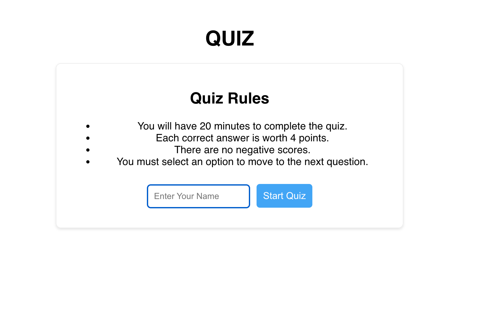

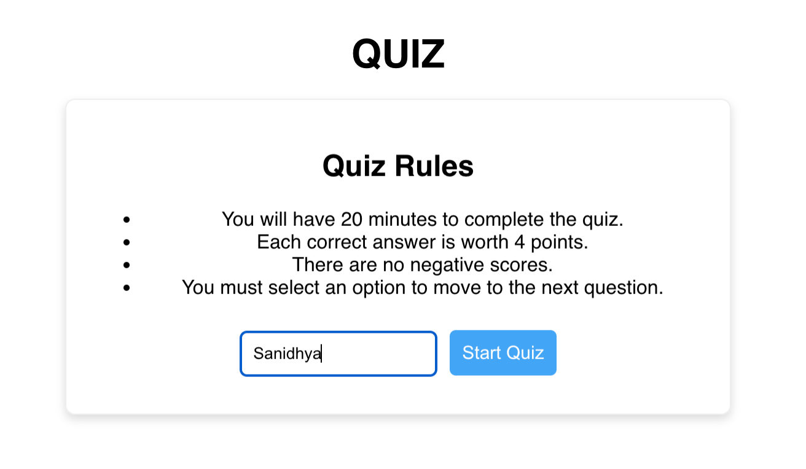

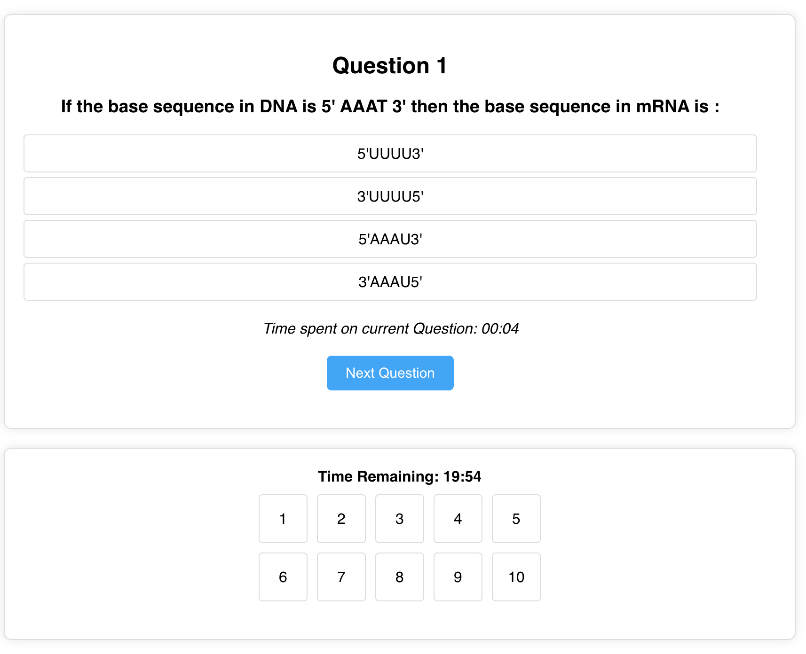

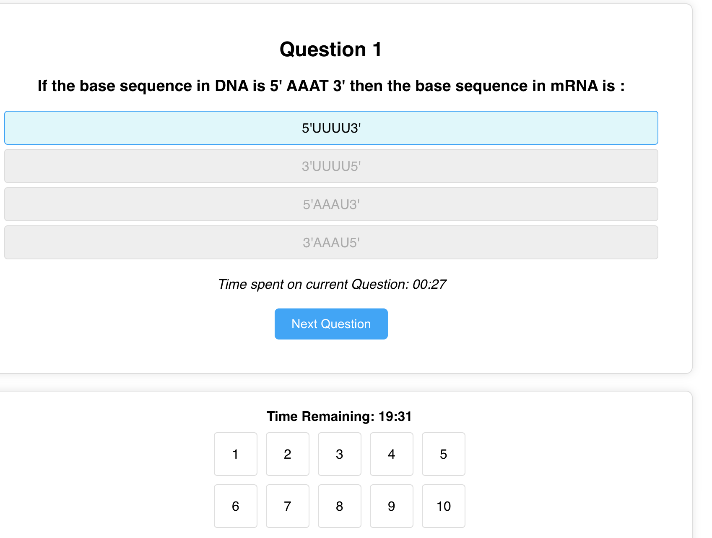

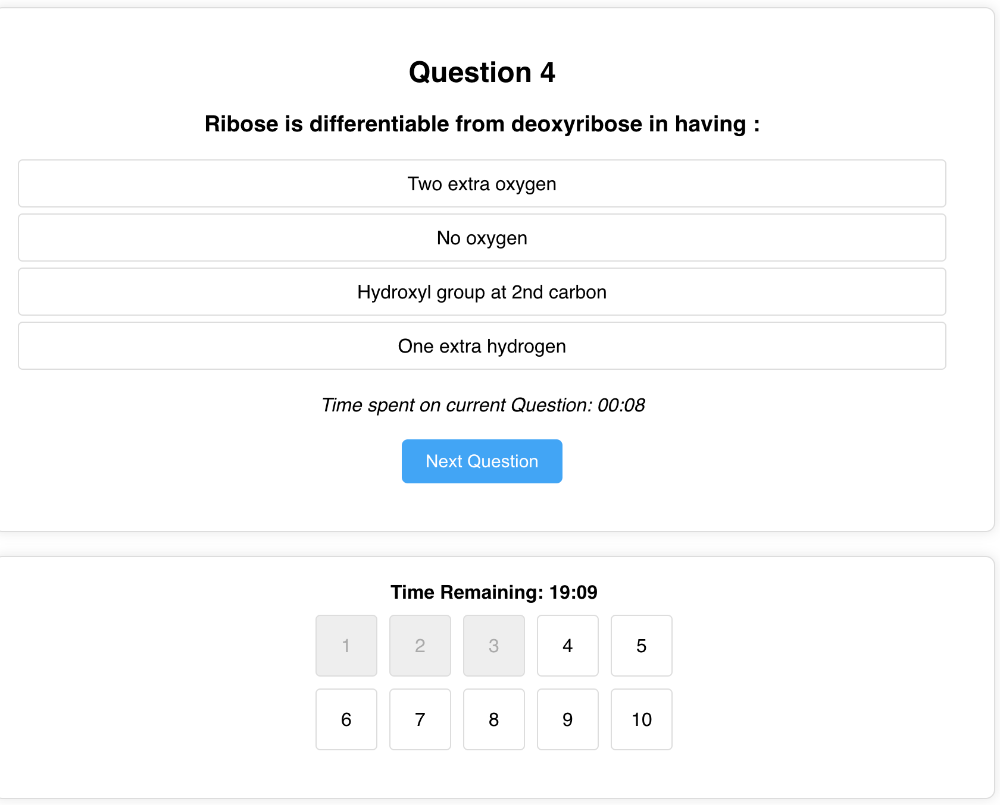

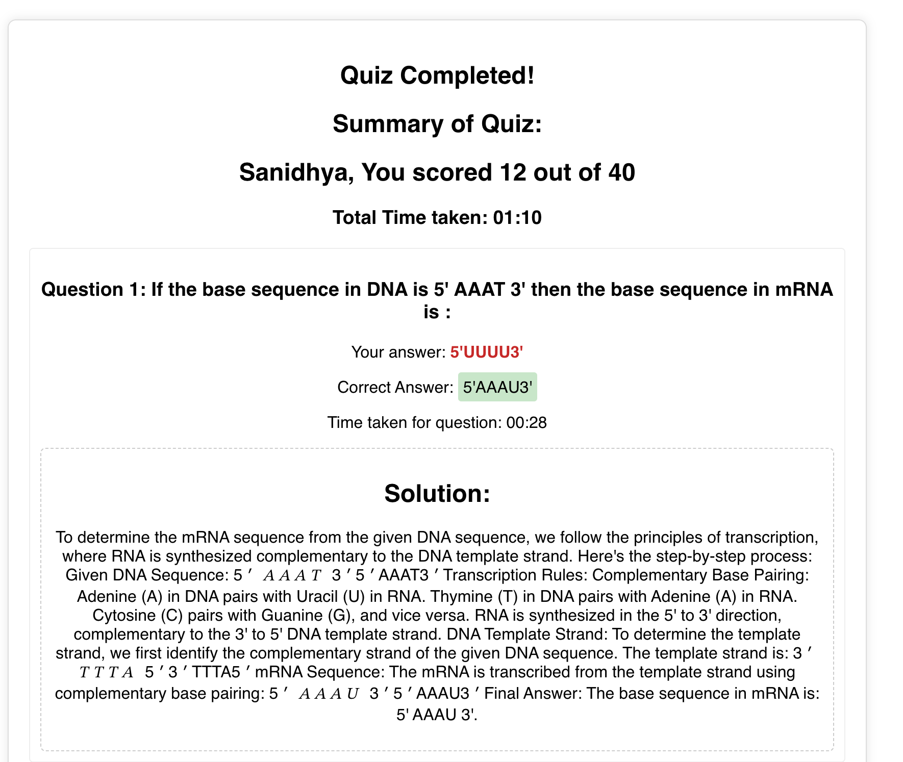

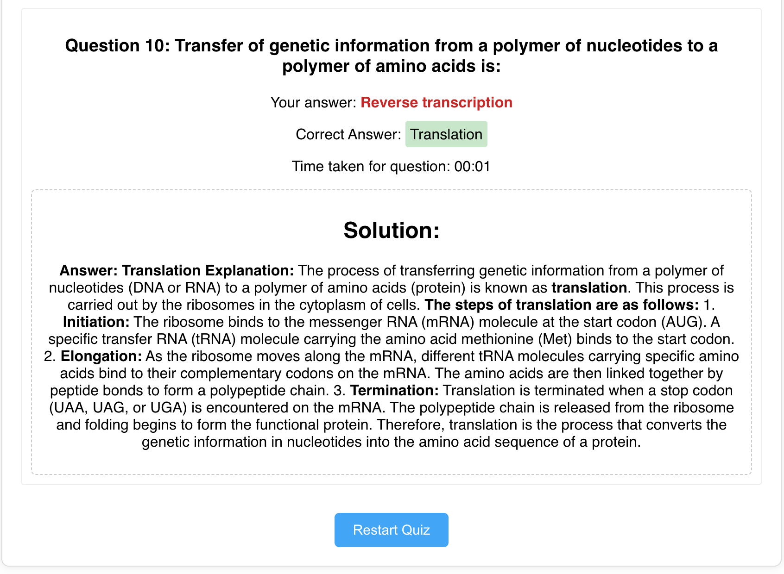

## Routing

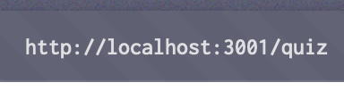

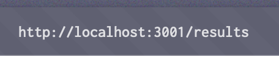

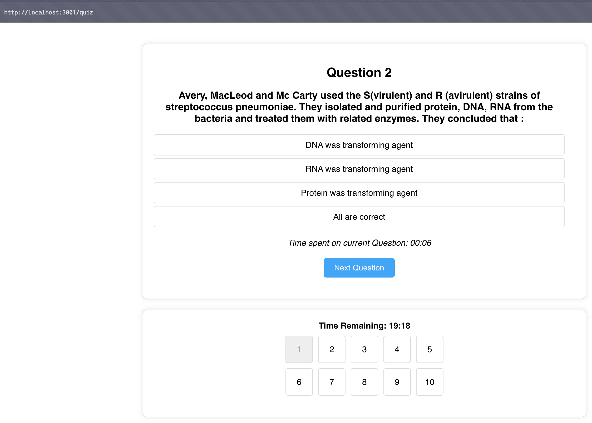

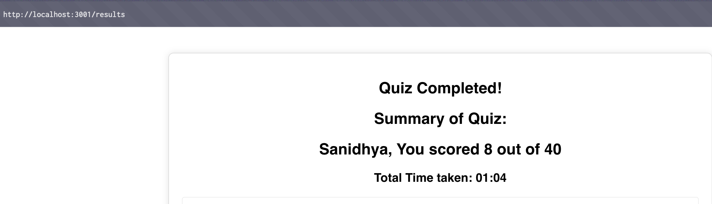


## Video Demonstration

[Watch the video](Demonstration/demo.mp4)

## Prerequisites

Before you begin, make sure you have the following installed:

-   [Node.js](https://nodejs.org/) (version 18 or higher)
-   [npm](https://www.npmjs.com/) (usually included with Node.js)
-   [Git](https://git-scm.com/) (optional)

## Getting Started

1.  **Clone the repository (optional):**

    ```bash
    git clone https://github.com/SpaceCypher/Quiz-Flow.git
    cd quiz-app
    ```

2.  **Navigate to the server directory:**

    ```bash
    cd server
    ```

3.  **Install server dependencies:**

    ```bash
    npm install
    ```

4.  **Create a `.env` file**

    In the `server` directory, create a new file called `.env` and add your api link:

    ```
    API_URL=<YOUR_API_URL_HERE>
    ```

5.  **Start the server:**

    ```bash
    npm run dev # or npm start
    ```

    The backend should now be running on `http://localhost:5000` (or `http://localhost:3000` if you made the change to the port).

6.  **Open another terminal and Navigate to the client directory:**

    ```bash
    cd ../client
    ```

7.  **Install client dependencies:**

    ```bash
    npm install
    ```

8.  **Start the client:**

    ```bash
    npm start
    ```

    The frontend should now be running on `http://localhost:3000`.

9.  **Open the Quiz**
     * Open your browser and go to `http://localhost:3000` to access the landing page, from there, you can start your quiz.

## File Structure
quiz-app/
├── client/
│ ├── src/
│ │ ├── components/
│ │ │ ├── Quiz.js (Main quiz logic)
│ │ │ ├── Question.js (Display individual question)
│ │ │ ├── Results.js (Display quiz results)
│ │ │ ├── Home.js (Display landing page)
│ │ ├── App.js (Main app component and router)
│ │ ├── index.js (Entry point)
│ │ ├── styles.css (Basic CSS for styling)
│ ├── package.json
│ ├── public/
│
├── server/
│ ├── index.js (Main server file)
│ ├── api.js (API route)
│ ├── package.json
│
├── package.json (root package.json)
## Technologies Used

*   React
*   Node.js
*   Express
*   Axios
*   React Router
*   dotenv

## Contributing
If you would like to contribute to this project, please follow these steps:

Fork the repository.

Create a new branch for your feature or bug fix.

Make your changes and test them thoroughly.

Submit a pull request with a clear description of your changes.

License
This project is licensed under the MIT License.


